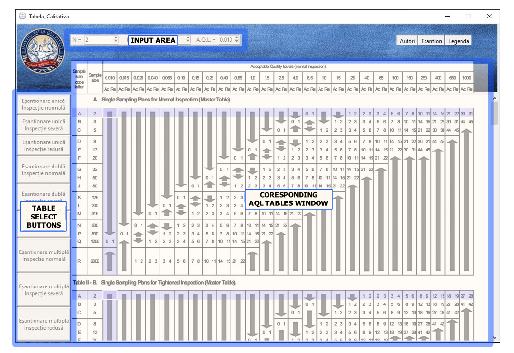

#	Welcome to my Project Repository

	The presented Python application is a digital version of an extended 
AQL Table used for determining the overall production quality based on 
a given product batch.
	This specific iteration has been developed by me with the assistance 
of some of my colleagues, in accordance with our guiding teacher's
 requests for one of our university projects.
	A quick summary of the application's GUI elements can be done as in 
the following image:

	As for understanding how to read the displayed tables, compared to
the usual methods of either displaing the answers directly or navigating
the table in acordance to it's rules of use, the GUI incorporates the 
advantage of viewing other potential results on the table and qwick 
navigation to said results, somewhat of a midle-ground between the 
previously mentioned methods.
